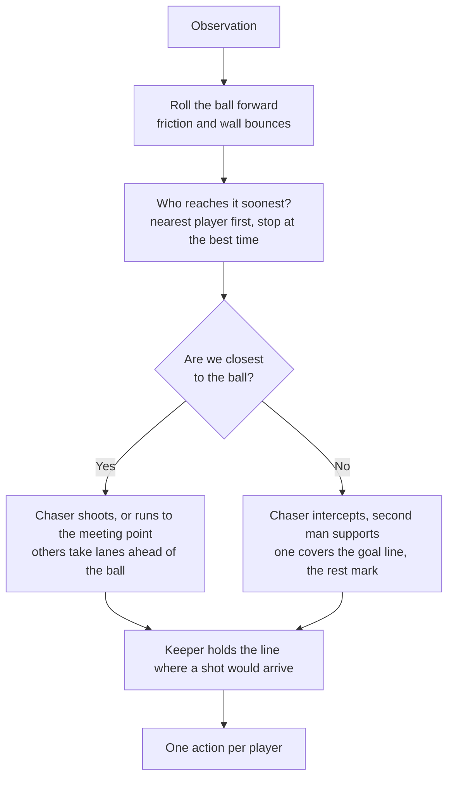

# Soccer AI — a team that predicts the ball instead of chasing it

A Python soccer agent written for a 107-team university league. Five players,
twenty decisions a second, one function: given the state of the pitch, decide
what every player does next — in under 20 milliseconds, or the team forfeits
the tick.

## Demo

<!--
TODO: record a short GIF and save it to docs/demo.gif, then replace this block with:


To capture it: ./start.sh play my-team --against tactical --replay demo.rep
then open demo.rep in the browser viewer and screen-record ~10 seconds that
includes a goal — ideally one where the keeper slides across to the far post.
-->

> **Screenshot pending.** See the capture instructions in the source of this file.

## Why I built it

This was coursework, but the league table made it competitive: every team plays
every other team over a hidden seed set, and you can watch your own ranking move.
I wanted to find out how far you could get on prediction alone — no machine
learning, no training runs, just replaying the simulator's own physics a few
frames ahead and acting on where the ball is *going* to be. It turned out to be
worth a lot, and the things I assumed would help (passing, keeping possession)
actively hurt.

## How it ranks

From the league standings, averaged over 1060 matches:

| Metric | Value | Rank |
| --- | --- | --- |
| Goals per match | 2.86 | **#10** of 107 |
| Interceptions per match | 12.46 | **#10** of 107 |
| Attacking territory | 56.8% | **#10** of 107 |
| Shots per match | 8.83 | #19 of 107 |
| Goals conceded per match | 0.75 | #38 of 107 |
| Mean decision time | 0.244 ms | of a 20 ms budget |

The defensive work described below landed after this snapshot was taken.

## The strategies

**Predict the ball, don't chase it.** The engine publishes its own physics
constants, so the team replays them: it rolls the ball forward six seconds under
friction and wall bounces, then asks each player how soon they could reach each
point on that path. Whoever arrives soonest becomes the chaser and runs to the
*meeting point*, not to the ball. A player the ball is rolling towards beats a
closer one who has to turn round.

**Only one player goes.** Everyone else holds a shape — fixed lanes across the
pitch, ten units ahead of where the ball will be in half a second. Four players
converging on the ball is the single most common way to lose one of these
matches.

**Aim where the keeper isn't.** A kick *adds* to the ball's current velocity
rather than replacing it, so a struck ball never travels along the line it was
aimed at. The team solves a quadratic for the direction that makes the ball end
up going where it actually wanted, then picks the half of the goal the opposing
keeper is furthest from — projecting their position forward by the flight time,
so it aims at where they'll be rather than where they are.

**The keeper stands where the shot will arrive.** Friction scales both axes by
the same factor, so the whole roll of the ball is one parameter: solve for where
it crosses the keeper's line and go there. With nothing coming, he sits on the
line from the ball to the middle of the goal — which, two units off his line, is
much closer to centre than copying the ball's y position.

**Somebody covers the goal.** Man-marking stands a defender *beside* an
opponent, which does nothing against a shot. The deepest spare defender instead
holds the line between the ball and his own goal, so a shot has to beat a body
before it reaches the keeper. This was the single biggest improvement I made.

**Don't pass.** I built a full passing system — lane scoring, velocity-led
targets, distance-sized power — and it lifted pass completion from 20% to 50%
and possession from 37% to 63%, while costing a third of the team's points in
testing. The same happened with dribbling. Every time the ball goes anywhere
other than at goal, this team loses. Low ball-control and dribble ranks turned
out to be the signature of a strategy that works, not a fault in it.

## Tech stack

| Layer | Choice | Why |
| --- | --- | --- |
| Language | Python 3.8+, single file | Course constraint — the marker loads `team.py` on its own, so no imports of my own |
| Physics | Replay of the engine's published constants | Matches the simulator exactly, so predictions agree with what actually happens |
| Ball path | Built lazily, one point per two ticks | Most ticks a player meets the ball inside half a second; the other five and a half were being built and binned |
| Actions | Plain dicts, not the SDK's dataclasses | The engine accepts both; the typed ones are frozen dataclasses built five times a tick |
| Testing | Hold-out seed sets, process-parallel | One match is close to a coin toss — I judge changes over 600+ matches on seeds I never tuned on |

## How it works

Every tick runs the same pipeline, and each player leaves it with exactly one action.



One detail that costs more than it looks: every move target is pushed clear of
the centre circle while the opposition takes a kickoff. Standing in it is the
only foul in the game, and it costs that player about four seconds walking back
from a touchline.

## Getting started

This repo holds **my team, not the simulator**. The course scaffold — engine,
SDK, viewer — isn't mine to redistribute, so it's gitignored.

With the course platform already set up, drop `my-team/team.py` into it and:

```bash
./start.sh play my-team --against tactical      # one match
./start.sh validate my-team                     # legal? inside the deadline?
./start.sh tournament my-team --against tactical --seeds 1000..1020
```

On Windows, write `START.cmd` instead of `./start.sh`. Matches are
deterministic — same team, opponent and seed gives the same match every time,
which is what makes any of this debuggable.

## Roadmap and known limitations

- **No passing, deliberately.** Tested and rejected on the numbers, but it means
  the team can't break down an opponent that parks in front of its own goal.
- **Fixed lanes.** Off-ball players never swap sides, so the shape can end up
  inverted relative to the play.
- **`initial_formation` is untouched.** The side taking a kickoff can't be
  challenged for it, so a formation built to win the first touch is free value I
  haven't taken.
- **Decision time.** Roughly 0.18 ms of the 20 ms budget. I can get it to ~0.09 ms
  by recomputing only every other tick, but that costs real points, and league
  points decide your division while time only orders you inside it.
- **Tuned against the reference baselines**, not against the other 106 student
  teams, which are the actual opposition.

## What I learned

The biggest lesson was about measurement, not football. Nearly every change I
was confident about — passing, possession, dribbling — made the team worse, and
the two that mattered most (a covering defender, and where the keeper stands)
looked like small positional tweaks. A single match is close to a coin toss, so I
ended up testing every idea over hundreds of matches on seed sets I hadn't tuned
on, and more than once a result that looked like a clear win on one set turned
out to be noise on another. I also learned to verify optimisations rather than
trust them: the speed work is checked by replaying 60,000 player-decisions and
confirming not one of them changed, which is how I caught a tie-break bug that
was silently sending the wrong player after the ball.

## Licence

University coursework, published for portfolio purposes. The simulation engine
and SDK it runs against belong to the course and are not included here.
